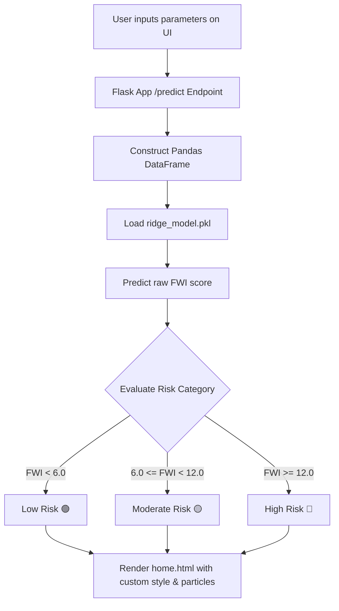

# 🔥 Forest Fire Weather Index (FWI) Predictor

[](https://www.python.org/)
[](https://flask.palletsprojects.com/)
[](https://scikit-learn.org/)
[](https://pandas.pydata.org/)

An advanced, interactive web application powered by **Machine Learning (Ridge Regression)** to predict the **Forest Fire Weather Index (FWI)**. The system evaluates current atmospheric conditions and fuel moisture levels to classify wildfire risk, displaying results in a premium, dynamically animated dashboard.

---

## 🖥️ User Interface & Dashboard Features

The application is built with a highly polished, modern design aesthetic featuring:
*   🌌 **Responsive Glassmorphism UI**: Beautiful semi-transparent card panels with blur filters and ambient glow.
*   ✨ **Atmospheric Particle Animations**: Interactive floating green/blue/red particles reflecting the current threat level.
*   🎨 **Dynamic Theme Adaptation**: The dashboard background and glow color automatically adapt to the risk level:
    *   🟢 **Low Risk**: Cool green/blue ambient glow.
    *   🟡 **Moderate Risk**: Warm amber/orange glow.
    *   🔴 **High Risk**: Fiery dark red background with floating fire particles.
*   📊 **Interactive Gauges & Risk Categories**: Visual indicator highlighting the exact FWI index and threshold comparisons.

---

## ⚙️ Application Workflow



---

## 📝 Input Features Explained

The model makes predictions using **8 specific meteorological and fuel moisture inputs**:

### 1. Atmospheric Conditions
| Feature | Unit | Standard Range | Description |
| :--- | :--- | :--- | :--- |
| **Temperature** | °C | $0^\circ\text{C} - 45^\circ\text{C}$ | Ambient air temperature. Higher values accelerate fuel drying. |
| **Relative Humidity (RH)** | % | $10\% - 100\%$ | Relative moisture content of the air. Lower humidity increases flammability. |
| **Wind Speed (WS)** | km/h | $5 - 40\text{ km/h}$ | Wind speed. Drives fire propagation and oxygen supply. |
| **Rainfall** | mm | $\ge 0\text{ mm}$ | Precipitation accumulated in the past 24 hours. |

### 2. Fuel Moisture Codes (Canadian FWI System)
*   **FFMC (Fine Fuel Moisture Code)**: Represents the moisture content of litter and other cured fine fuels (1-2 cm deep). Highly sensitive to weather changes and indicates ease of ignition.
*   **DMC (Duff Moisture Code)**: Represents the average moisture content of loosely compacted organic layers (5-10 cm deep).
*   **DC (Drought Code)**: Represents the moisture content of deep, compact organic layers (10-20 cm deep). Reflects seasonal drought conditions.
*   **ISI (Initial Spread Index)**: Combines wind speed and FFMC to estimate the expected rate of fire spread immediately after ignition.

---

## 🔮 Machine Learning Model & Scaling Details

*   **Algorithm**: Ridge Regression (L2 Regularization)
*   **Serialized Files**: 
    *   `ridge_model.pkl` - Trained Ridge regression model.
    *   `scaler.pkl` - Serialized StandardScaler.
*   **Important Usage Note**: The Ridge model was trained on **raw (unscaled) features**. To ensure consistency, the Flask application passes raw inputs to the model for predictions. The `scaler.pkl` is loaded but not applied, keeping outputs aligned with training logic.

### Fire Risk Level Mapping
The FWI score is mapped to risk categories using the following thresholds:

$$\text{FWI Score} \longrightarrow \begin{cases} 
\text{High Risk } (\color{red}{\text{Red}}) & \text{if } \text{FWI} \ge 12.0 \\
\text{Moderate Risk } (\color{orange}{\text{Orange}}) & \text{if } 6.0 \le \text{FWI} < 12.0 \\
\text{Low Risk } (\color{green}{\text{Green}}) & \text{if } \text{FWI} < 6.0 
\end{cases}$$

---

## 🚀 Setup & Installation

### 1. Prerequisites
Ensure you have Python 3.8 or higher installed on your system.

### 2. Install Dependencies
Install all required libraries using the provided `requirements.txt`:
```bash
pip install -r requirements.txt
```

### 3. Run the Application
Start the Flask development server:
```bash
python FWI_Predictor/app.py
```

By default, the server will start at:
👉 **[http://127.0.0.1:5000/](http://127.0.0.1:5000/)**

---

## 📁 Repository Structure

```text
FWI_PREDICTOR/
│
├── FWI_Predictor/
│   ├── app.py                # Main Flask application router & prediction logic
│   └── templates/
│       ├── index.html        # Interactive input form dashboard
│       └── home.html         # Gauge visualizer & results screen
│
├── ridge_model.pkl           # Trained Ridge regression ML model
├── scaler.pkl                # Serialized feature scaler (not applied)
├── requirements.txt          # Python dependencies
└── README.md                 # Project documentation
```

---

## 🛡️ License
This project is open-source and available under the MIT License.
